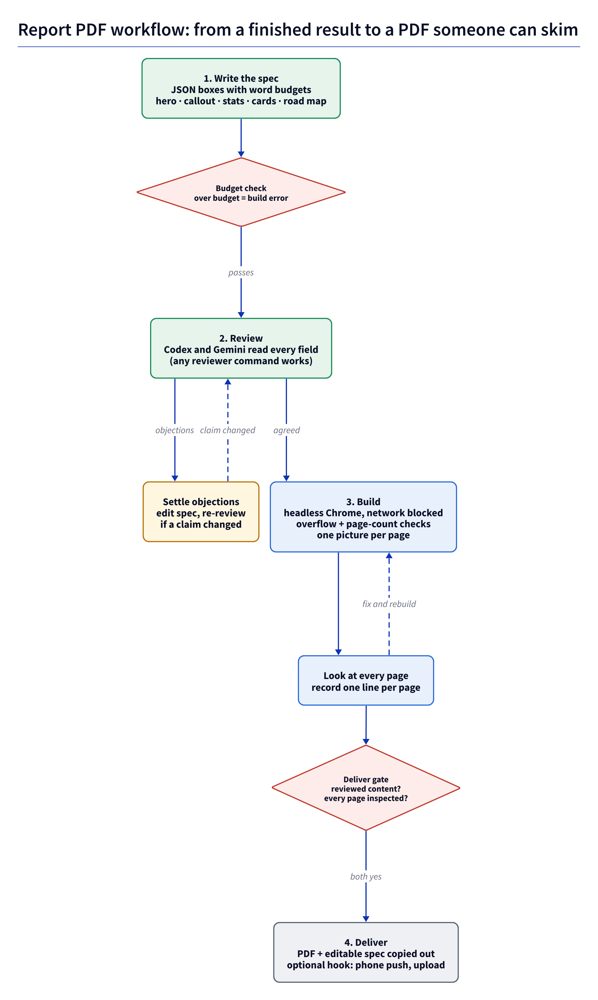
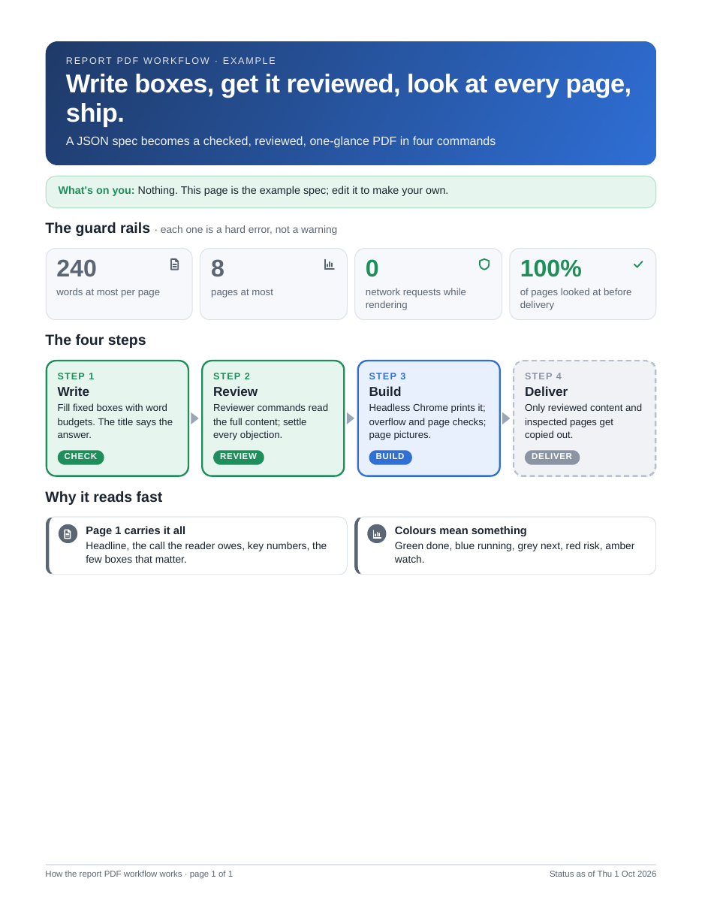

# infographic-report-pdf

Turn a finished result (a report, plan, review or research answer) into a one-glance infographic PDF that someone
can skim instead of reading a wall of text. Built for AI coding agents (Claude Code, Codex, Gemini CLI) but works
the same by hand.



## What you get



- **A fixed box catalogue, not free HTML.** You write a JSON spec of blocks (hero, callout, stats, cards, road map,
  before/after, steps, bars, list, table, note, image, two-column). Word budgets per field and 240 words per page are
  build errors, on purpose: cut words, never shrink text. See `reference/spec.md`.
- **No network while rendering.** Chromium (Playwright) loads the page from a loopback-only server; every other
  request is aborted and a dead proxy backs that up. `check` refuses HTML tags and URLs in any field, all text is HTML-escaped anyway,
  and images must be files inside the spec's own folder.
- **Layout checks.** A build fails on any box whose text overflows, any block that runs off its page, text under
  10 px, or a PDF whose page count differs from the spec.
- **Gates.** `deliver` refuses content that was not reviewed (a content hash ties the review to the exact text) and
  any page nobody recorded looking at.

### What it does not protect against
- The gates are a discipline aid, not a security control: `deliver --unreviewed` skips the review, and a review
  receipt only proves each reviewer command exited 0 with some output, not that it agreed.
- Reviewer commands and the `--after` hook run through your shell with your permissions and may use the network;
  only pass commands you trust. Review packets (the full report text) go to whatever those commands call.
- Install (`npm ci`, `npx playwright install chromium`) downloads packages and a browser from the internet.
- `--out` and `--to` are trusted paths you choose: symlinked parent folders are followed.
- Build folders and `.report-pdf/` hold the report text and absolute local paths; they are git-ignored, keep them
  out of commits.

## Install

Needs Python 3.9+, Node 20+, and poppler's `pdftoppm` (`apt install poppler-utils`, `brew install poppler`).

```sh
npm ci                               # Playwright, pinned by package-lock.json
npx playwright install chromium      # the browser it drives
```

## Use

```sh
python3 scripts/report_pdf.py new my.json                 # starter spec
python3 scripts/report_pdf.py check my.json               # budgets and schema
python3 scripts/report_pdf.py review my.json \
  --reviewer 'codex=codex exec -s read-only -' \
  --reviewer 'gemini=gemini -p "Review the deliverable on stdin"' \
  --context "what was asked, where the facts came from"
# read each answer in .report-pdf/review-*/, fix the spec, review again if a claim changed
python3 scripts/report_pdf.py build my.json --out build
# open build/page-N.png and look at every page
python3 scripts/report_pdf.py inspected build --page 1 "what you checked and saw"
python3 scripts/report_pdf.py deliver my.json --build build --to ~/Reports \
  --resolved "how the reviewers' objections were settled" \
  --after 'notify-send "Report ready" "$REPORT_TITLE"'
```

A reviewer is any shell command that reads the review packet on stdin and writes its answer to stdout; check the
exact flags for your installed CLI. Reviewer commands and `--after` run through your shell with your permissions,
so only pass commands you trust. Receipts live in `.report-pdf/receipts.jsonl` next to the spec
(`REPORT_PDF_STATE` overrides).

## Writing a good page

- The title says the answer ("Checkout is 40% faster after the cache fix", not "Performance update").
- Page 1 carries it all: the headline, a callout with what the reader must do (or "nothing right now"), 2 to 4
  headline numbers with context, then the few boxes that matter. Later pages are detail.
- One idea per box, plain words, no jargon. Status colours mean something: done green, running blue, next grey,
  risk red, watch amber, info grey.
- A road map or before/after whenever there is a sequence or a change.

## Using it as an agent skill

Copy this folder to `.claude/skills/report-pdf/` (Claude Code) or your agent's skill folder; `SKILL.md` tells the
agent the steps.

## License

MIT, see `LICENSE`.
